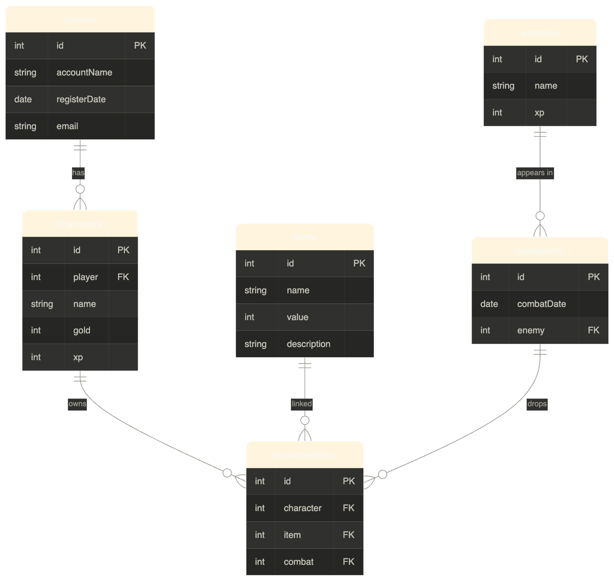

# MMO feladatok

## Szükséges táblák

- **players** tábla létrehozása
- **characters** tábla (players - characters: 1:N kapcsolat)
- **items** tábla létrehozása
- **CharacterItemConnection** tábla létrehozása (characters - items: N:N kapcsolat)
- **enemies** tábla létrehozása
- **combatinfo** tábla létrehozása

|Tábla|Tulajdonság|
|---|---|
|players|id, accountName, registerDate(2010-206), email|
|charactes|id, player(FK), name, gold(0-9999), xp(0- 99_999)|
|items|id, name,value(1-100),description|
|characterItems|id,character(FK),item(FK),combat(FK)|
|enemies|id, name, xp(1-1000)|
|combatInfo|id, combatDate(), enemy(FK)|

## Sorrend:
- Players
- Enemies
- Items
- Characters
- CombatInfo
- CharacterItesm